<div align="center">

# 🍳 Ravano Secret Kitchen Mobile App

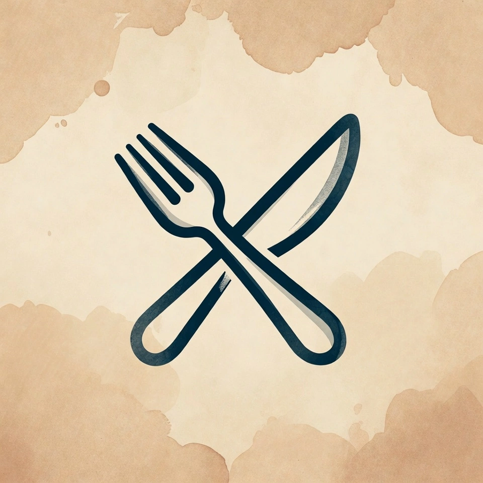

### *Temukan Ribuan Resep Masakan Nusantara dari Genggaman Anda!*

<br/>

<!-- Tech Stack Badges -->


<!-- Status Badges -->


<br/>

---

**Aplikasi mobile resep masakan nusantara yang cantik & responsif.**
**Dibangun dengan ❤️ menggunakan React Native, Expo, dan TypeScript.**

---

</div>

<br/>

<!-- ==================== DAFTAR ISI ==================== -->

## 📑 Daftar Isi

- [✨ Fitur Utama](#-fitur-utama)
- [🎨 Design System](#-design-system)
- [🚀 Cara Menjalankan](#-cara-menjalankan)
- [🛠️ Tech Stack](#️-tech-stack)
- [📦 Dependencies](#-dependencies)
- [🏗️ Arsitektur Aplikasi](#️-arsitektur-aplikasi)
- [📁 Struktur Proyek](#-struktur-proyek)
- [📖 Penjelasan Struktur](#-penjelasan-struktur)
- [🧩 Komponen Utama](#-komponen-utama)
- [🔌 API & Services](#-api--services)
- [📸 Screenshots](#-screenshots)
- [📜 Scripts](#-scripts)
- [👨‍💻 Author](#-author)

<br/>

<!-- ==================== FITUR UTAMA ==================== -->

## ✨ Fitur Utama

<table>
<tr>
<td width="50%">

### 🏠 Beranda Interaktif
Jelajahi resep terbaru dan populer dengan tampilan kartu yang memukau, lengkap dengan gambar, badge kategori, tingkat kesulitan, dan waktu memasak.

### 🔍 Pencarian Cepat
Modal pencarian yang elegan untuk menemukan resep favorit Anda dengan cepat dan mudah.

### 📂 Kategori Lengkap
Filter resep berdasarkan kategori — Masakan Utama, Kue, Minuman, Sayuran, dan lainnya melalui sidebar navigasi.

</td>
<td width="50%">

### 📖 Detail Resep Lengkap
Panduan memasak dengan **3 tab interaktif**:
- 🥘 **Bahan-bahan** — Daftar lengkap bahan & takaran
- 👨‍🍳 **Cara Membuat** — Langkah demi langkah
- 🎬 **Video Tutorial** — Panduan visual via YouTube

### 🌗 Dark & Light Mode
Tema yang mengikuti sistem perangkat atau pilih secara manual melalui Settings Modal (System / Light / Dark).

### 🔐 Autentikasi
Sistem login & register pengguna dengan **JWT token** dan **AsyncStorage** untuk sesi yang aman.

</td>
</tr>
</table>

> 💡 **Fitur Tambahan**: Custom Toast Notification dengan swipe-to-dismiss, Logout Modal dengan outside-click dismiss, Responsive UI untuk berbagai ukuran layar, dan gesture navigation support.

<br/>

<!-- ==================== DESIGN SYSTEM ==================== -->

## 🎨 Design System

Aplikasi menggunakan sistem warna yang konsisten dan harmonis:

<table>
<tr>
<th>🌞 Light Theme</th>
<th>🌙 Dark Theme</th>
</tr>
<tr>
<td>

| Token | Warna | Hex |
|:---:|:---:|:---:|
| Primary | 🟠 | `#f97316` |
| Background | 🩷 | `#fdf5f0` |
| Card | ⬜ | `#ffffff` |
| Text | ⬛ | `#1f2937` |
| Secondary | 🟡 | `#fbdec0` |
| Border | 🩶 | `#e5e7eb` |
| Error | 🔴 | `#dc2626` |
| Gray | 🩶 | `#6b7280` |

</td>
<td>

| Token | Warna | Hex |
|:---:|:---:|:---:|
| Primary | 🟠 | `#f97316` |
| Background | ⬛ | `#000000` |
| Card | 🔵 | `#1f2937` |
| Text | ⬜ | `#ffffff` |
| Secondary | 🩶 | `#374151` |
| Border | 🩶 | `#374151` |
| Error | 🔴 | `#ef4444` |
| Gray | 🩶 | `#9ca3af` |

</td>
</tr>
</table>

**Tingkat Kesulitan Resep:**

| Level | Badge Light | Badge Dark |
|:---:|:---:|:---:|
| 🟢 **Mudah** | `#ecfdf5` / `#059669` | `#064e3b` / `#34d399` |
| 🟡 **Sedang** | `#fffbeb` / `#d97706` | `#78350f` / `#fbbf24` |
| 🔴 **Sulit** | `#fef2f2` / `#dc2626` | `#7f1d1d` / `#f87171` |

<br/>

<!-- ==================== CARA MENJALANKAN ==================== -->

## 🚀 Cara Menjalankan

### 📋 Prasyarat

| Requirement | Versi |
|:---|:---|
|  | `>= 18.x` |
|  | `>= 9.x` |
|  | Terpasang di HP |
|  | Port `5000` |

### ⚡ Langkah Instalasi

**1️⃣ Clone Repository**
```bash
git clone https://github.com/ravano-2464/Ravano-Secret-Kitchen-Mobile.git
cd Ravano-Secret-Kitchen-Mobile
```

**2️⃣ Install Dependencies**
```bash
npm install
```

**3️⃣ Konfigurasi Environment**

Buat file `.env` di root proyek:
```env
EXPO_PUBLIC_API_URL=http://YOUR_LOCAL_IP:5000/api
```

> ⚠️ **Catatan**: Pada mode development, aplikasi akan otomatis mendeteksi IP lokal melalui `Constants.expoConfig.hostUri` sehingga `.env` bersifat opsional.

**4️⃣ Jalankan Aplikasi**
```bash
npx expo start
```

**5️⃣ Buka di Perangkat**

| Platform | Cara |
|:---|:---|
| 📱 **Android** | Scan QR code dengan **Expo Go** |
| 🍎 **iOS** | Scan QR code dengan **Camera** app |
| 🌐 **Web** | Tekan `w` di terminal |

<br/>

<!-- ==================== TECH STACK ==================== -->

## 🛠️ Tech Stack

<div align="center">

| Kategori | Teknologi | Versi |
|:---|:---|:---:|
| **Framework** |  Expo | `54.0.33` |
| **UI Framework** |  React Native | `0.81.5` |
| **Library** |  React | `19.1.0` |
| **Bahasa** |  TypeScript | `5.9.2` |
| **Routing** |  Expo Router | `6.0.23` |
| **HTTP Client** |  Axios | `1.13.5` |
| **Navigation** |  React Navigation | `7.x` |
| **Animations** |  React Native Reanimated | `4.1.1` |
| **Storage** |  Async Storage | `2.2.0` |
| **Icons** |  Ionicons | `via @expo/vector-icons` |
| **Gestures** |  Gesture Handler | `2.28.0` |
| **Toast** |  React Native Toast | `2.3.3` |
| **WebView** |  React Native WebView | `13.16.0` |

</div>

<br/>

<!-- ==================== DEPENDENCIES ==================== -->

## 📦 Dependencies

<details>
<summary><b>🔧 Production Dependencies (21 packages)</b></summary>

| Package | Versi | Deskripsi |
|:---|:---:|:---|
| `@expo/vector-icons` | `^15.0.3` | Koleksi ikon vektor (Ionicons, FontAwesome, dll) |
| `@react-native-async-storage/async-storage` | `^2.2.0` | Penyimpanan data lokal asinkron |
| `@react-navigation/drawer` | `^7.8.0` | Navigasi sidebar drawer |
| `@react-navigation/native` | `^7.1.8` | Core React Navigation |
| `axios` | `^1.13.5` | HTTP client untuk komunikasi API |
| `expo` | `~54.0.33` | Framework utama Expo |
| `expo-constants` | `~18.0.13` | Akses konstanta sistem & config |
| `expo-font` | `~14.0.11` | Muat custom font |
| `expo-linking` | `~8.0.11` | Deep linking & URL handling |
| `expo-router` | `~6.0.23` | File-based routing system |
| `expo-splash-screen` | `~31.0.13` | Splash screen management |
| `expo-status-bar` | `~3.0.9` | Kontrol status bar perangkat |
| `expo-web-browser` | `~15.0.10` | In-app web browser |
| `react` | `19.1.0` | Library UI core |
| `react-dom` | `19.1.0` | React renderer untuk web |
| `react-native` | `0.81.5` | Framework mobile core |
| `react-native-gesture-handler` | `~2.28.0` | Gesture recognition (swipe, pan, dll) |
| `react-native-reanimated` | `~4.1.1` | Animasi native yang performa tinggi |
| `react-native-safe-area-context` | `~5.6.0` | Safe area insets (notch, home indicator) |
| `react-native-screens` | `~4.16.0` | Native screen components optimization |
| `react-native-toast-message` | `^2.3.3` | Toast notification system |
| `react-native-web` | `~0.21.0` | React Native compatibility untuk web |
| `react-native-webview` | `^13.16.0` | Embedded webview component |
| `react-native-worklets` | `0.5.1` | Worklet threads for Reanimated |

</details>

<details>
<summary><b>🛠️ Dev Dependencies (3 packages)</b></summary>

| Package | Versi | Deskripsi |
|:---|:---:|:---|
| `@types/react` | `~19.1.0` | TypeScript type definitions untuk React |
| `react-test-renderer` | `19.1.0` | Renderer untuk unit testing komponen |
| `typescript` | `~5.9.2` | TypeScript compiler |

</details>

<br/>

<!-- ==================== ARSITEKTUR ==================== -->

## 🏗️ Arsitektur Aplikasi

```
┌──────────────────────────────────────────────────────────────┐
│                      📱 PRESENTATION LAYER                   │
│                                                              │
│  ┌──────────┐  ┌──────────┐  ┌──────────┐  ┌──────────────┐ │
│  │  (auth)   │  │  (tabs)  │  │  recipe   │  │    modal     │ │
│  │  Login    │  │  Home    │  │  [id]     │  │  Settings    │ │
│  │  Register │  │  Profile │  │  Detail   │  │  Logout      │ │
│  └──────────┘  └──────────┘  └──────────┘  └──────────────┘ │
│                                                              │
├──────────────────────────────────────────────────────────────┤
│                    🧩 COMPONENT LAYER                        │
│                                                              │
│  HomeHeader │ RecipeCard │ Sidebar │ SearchDialogModal       │
│  CustomToast │ VideoPlayer │ LogoutModal │ SettingsModal     │
│                                                              │
├──────────────────────────────────────────────────────────────┤
│                     🎣 HOOKS & CONTEXT                       │
│                                                              │
│  ThemeContext (Light/Dark/System) │ useColorScheme            │
│  useClientOnlyValue              │ AsyncStorage persistence  │
│                                                              │
├──────────────────────────────────────────────────────────────┤
│                     🔌 SERVICE LAYER                         │
│                                                              │
│  Axios Instance │ JWT Interceptor │ Base URL Auto-Detection  │
│                                                              │
├──────────────────────────────────────────────────────────────┤
│                     🗄️ DATA LAYER                            │
│                                                              │
│  Recipe Interface │ TypeScript Types │ API Response Models    │
│                                                              │
├──────────────────────────────────────────────────────────────┤
│                    ☁️ BACKEND API (Express.js)               │
│                                                              │
│  REST API │ MongoDB │ JWT Auth │ Port 5000                   │
└──────────────────────────────────────────────────────────────┘
```

<br/>

<!-- ==================== STRUKTUR PROYEK ==================== -->

## 📁 Struktur Proyek

Berikut adalah struktur folder utama aplikasi mobile beserta penjelasannya:

```
Mobile/
├── 📁 app                          # Routing & halaman aplikasi (Expo Router)
│   ├── 📁 (auth)                   # Grup route autentikasi
│   │   ├── 📄 _layout.tsx          # Layout wrapper untuk halaman auth
│   │   ├── 📄 login.tsx            # Halaman login pengguna
│   │   └── 📄 register.tsx         # Halaman registrasi pengguna baru
│   ├── 📁 (tabs)                   # Grup route tab navigasi utama
│   │   ├── 📄 _layout.tsx          # Layout & konfigurasi tab bar
│   │   ├── 📄 index.tsx            # Halaman beranda (Tab Home)
│   │   └── 📄 profile.tsx          # Halaman profil pengguna (Tab Profile)
│   ├── 📁 recipe                   # Route dinamis untuk detail resep
│   │   └── 📄 [id].tsx             # Halaman detail resep berdasarkan ID
│   ├── 📄 +html.tsx                # Kustomisasi HTML untuk platform web
│   ├── 📄 +not-found.tsx           # Halaman 404 (route tidak ditemukan)
│   ├── 📄 _layout.tsx              # Root layout aplikasi (provider global)
│   └── 📄 modal.tsx                # Halaman modal bawaan
├── 📁 assets                       # Aset statis aplikasi
│   ├── 📁 fonts                    # Custom fonts
│   │   └── 📄 SpaceMono-Regular.ttf
│   └── 📁 images                   # Ikon & gambar aplikasi
│       ├── 🖼️ adaptive-icon.png    # Ikon adaptif Android (default)
│       ├── 🖼️ favicon.png          # Favicon untuk platform web (default)
│       ├── 🖼️ icon.png             # Ikon utama aplikasi (default)
│       ├── 🖼️ rsk-adaptive-icon.png # Ikon adaptif Android (RSK)
│       ├── 🖼️ rsk-favicon.png      # Favicon untuk platform web (RSK)
│       ├── 🖼️ rsk-icon.png         # Ikon utama aplikasi (RSK)
│       ├── 🖼️ rsk-splash-icon.png  # Ikon splash screen (RSK)
│       └── 🖼️ splash-icon.png      # Ikon splash screen (default)
├── 📁 components                   # Komponen UI yang dapat digunakan ulang
│   ├── 📁 __tests__                # Unit test untuk komponen
│   │   └── 📄 StyledText-test.js   # Test untuk komponen StyledText
│   ├── 📄 CustomToast.tsx          # Notifikasi toast kustom (swipe-to-dismiss)
│   ├── 📄 EditScreenInfo.tsx       # Komponen informasi edit screen
│   ├── 📄 ExternalLink.tsx         # Komponen link ke URL eksternal
│   ├── 📄 HomeHeader.tsx           # Header beranda dengan search bar & sidebar toggle
│   ├── 📄 LogoutModal.tsx          # Modal konfirmasi logout
│   ├── 📄 RecipeCard.tsx           # Kartu resep untuk ditampilkan di daftar
│   ├── 📄 SearchDialogModal.tsx    # Modal dialog pencarian resep
│   ├── 📄 SettingsModal.tsx        # Modal pengaturan (tema, dll)
│   ├── 📄 Sidebar.tsx              # Navigasi sidebar (drawer)
│   ├── 📄 StyledText.tsx           # Komponen teks dengan styling kustom
│   ├── 📄 Themed.tsx               # Komponen dasar yang mendukung tema (Text, View)
│   ├── 📄 VideoPlayer.tsx          # Pemutar video untuk platform native
│   └── 📄 VideoPlayer.web.tsx      # Pemutar video untuk platform web
├── 📁 constants                    # Konstanta & konfigurasi global
│   └── 📄 Colors.ts               # Definisi palet warna (light & dark theme)
├── 📁 context                      # React Context untuk state global
│   └── 📄 ThemeContext.tsx         # Context provider untuk manajemen tema
├── 📁 hooks                        # Custom React hooks
│   ├── 📄 useClientOnlyValue.ts    # Hook untuk nilai khusus client-side (native)
│   ├── 📄 useClientOnlyValue.web.ts # Hook untuk nilai khusus client-side (web)
│   ├── 📄 useColorScheme.ts        # Hook deteksi skema warna perangkat (native)
│   └── 📄 useColorScheme.web.ts    # Hook deteksi skema warna perangkat (web)
├── 📁 public                       # File publik & screenshot dokumentasi
│   ├── 📁 images                   # Screenshot aplikasi untuk README
│   │   ├── 🖼️ Ravano-Secret-Kitchen-Home-Pages.webp
│   │   ├── 🖼️ Ravano-Secret-Kitchen-Login-Pages.webp
│   │   ├── 🖼️ Ravano-Secret-Kitchen-Logout-Modal.webp
│   │   ├── 🖼️ Ravano-Secret-Kitchen-Profile-Page.webp
│   │   ├── 🖼️ Ravano-Secret-Kitchen-Recipe-Detail-Pages-Tabs-How-To-Make.webp
│   │   ├── 🖼️ Ravano-Secret-Kitchen-Recipe-Detail-Pages-Tabs-Ingredients.webp
│   │   ├── 🖼️ Ravano-Secret-Kitchen-Recipe-Detail-Pages-Tabs-Video-Tutorial.webp
│   │   ├── 🖼️ Ravano-Secret-Kitchen-Register-Pages.webp
│   │   ├── 🖼️ Ravano-Secret-Kitchen-Sidebar.webp
│   │   ├── 🖼️ Ravano-Secret-Kitchen-Settings-Modal.webp
│   │   └── 🖼️ Ravano-Secret-Kitchen-Search-Dialog-Modal.webp
│   └── 📁 logo                     # Logo aplikasi
│       └── 🖼️ Ravano-Secret-Kitchen-Logo.webp
├── 📁 services                     # Layer komunikasi dengan API backend
│   └── 📄 api.ts                   # Konfigurasi Axios & endpoint API
├── 📁 types                        # Definisi TypeScript types/interfaces
│   └── 📄 Recipe.ts                # Interface untuk data resep
├── ⚙️ .env                         # Environment variables (API URL, dsb.)
├── ⚙️ .gitignore                   # Daftar file/folder yang diabaikan Git
├── 📄 babel.config.js              # Konfigurasi Babel transpiler
├── 📄 expo-env.d.ts                # Deklarasi tipe environment Expo
├── ⚙️ app.json                     # Konfigurasi utama proyek Expo
├── ⚙️ package.json                 # Metadata proyek & daftar dependencies
├── ⚙️ package-lock.json            # Lock file versi dependencies
├── ⚙️ tsconfig.json                # Konfigurasi TypeScript compiler
└── 📝 README.md                    # Dokumentasi proyek ini
```

<br/>

<!-- ==================== PENJELASAN STRUKTUR ==================== -->

## 📖 Penjelasan Struktur

<table>
<tr>
<th width="25%">📂 Folder / File</th>
<th width="75%">📝 Deskripsi</th>
</tr>
<tr>
<td><code>app/</code></td>
<td>Folder inti untuk <b>file-based routing</b> menggunakan Expo Router. Setiap file <code>.tsx</code> di sini otomatis menjadi route/halaman. Grup <code>(auth)</code> menangani alur autentikasi, sedangkan <code>(tabs)</code> mendefinisikan navigasi tab utama (Home & Profile). Folder <code>recipe/</code> menggunakan dynamic route <code>[id].tsx</code> untuk menampilkan detail resep berdasarkan ID.</td>
</tr>
<tr>
<td><code>assets/</code></td>
<td>Menyimpan <b>aset statis</b> seperti font kustom (<code>SpaceMono-Regular.ttf</code>) dan gambar ikon aplikasi. Gambar dengan prefix <code>rsk-</code> adalah ikon bermerek Ravano Secret Kitchen.</td>
</tr>
<tr>
<td><code>components/</code></td>
<td>Kumpulan <b>komponen UI reusable</b> yang digunakan di berbagai halaman. Termasuk <code>HomeHeader</code> (header beranda), <code>RecipeCard</code> (kartu resep), <code>Sidebar</code> (navigasi samping), <code>SearchDialogModal</code> (pencarian), <code>CustomToast</code> (notifikasi), dan lainnya. File <code>.web.tsx</code> menandakan implementasi khusus platform web.</td>
</tr>
<tr>
<td><code>constants/</code></td>
<td>Menyimpan <b>nilai konstanta</b> yang digunakan secara global, seperti <code>Colors.ts</code> yang mendefinisikan palet warna untuk tema terang (light) dan gelap (dark).</td>
</tr>
<tr>
<td><code>context/</code></td>
<td>Berisi <b>React Context providers</b> untuk state management global. <code>ThemeContext.tsx</code> mengelola tema aplikasi (light/dark mode) agar dapat diakses di seluruh komponen.</td>
</tr>
<tr>
<td><code>hooks/</code></td>
<td>Kumpulan <b>custom React hooks</b> untuk logika yang dapat digunakan ulang. File <code>.web.ts</code> menyediakan implementasi alternatif untuk platform web (misalnya deteksi skema warna).</td>
</tr>
<tr>
<td><code>public/</code></td>
<td>Menyimpan <b>file publik</b> berupa screenshot aplikasi (format <code>.webp</code>) yang digunakan untuk dokumentasi README, beserta logo resmi aplikasi.</td>
</tr>
<tr>
<td><code>services/</code></td>
<td><b>Service layer</b> yang menangani komunikasi HTTP dengan API backend. <code>api.ts</code> mengkonfigurasi instance Axios dan mendefinisikan base URL dari environment variable.</td>
</tr>
<tr>
<td><code>types/</code></td>
<td>Berisi <b>definisi TypeScript types dan interfaces</b>. <code>Recipe.ts</code> mendefinisikan struktur data resep yang digunakan di seluruh aplikasi untuk type safety.</td>
</tr>
<tr>
<td><code>app.json</code></td>
<td>File konfigurasi utama proyek <b>Expo</b>, berisi nama aplikasi, ikon, splash screen, dan pengaturan platform (Android/iOS/Web).</td>
</tr>
<tr>
<td><code>tsconfig.json</code></td>
<td>Konfigurasi <b>TypeScript compiler</b>, termasuk path aliases dan strict mode settings.</td>
</tr>
<tr>
<td><code>.env</code></td>
<td>File <b>environment variables</b> yang menyimpan konfigurasi sensitif seperti URL API backend (<code>EXPO_PUBLIC_API_URL</code>).</td>
</tr>
</table>

<br/>

<!-- ==================== KOMPONEN UTAMA ==================== -->

## 🧩 Komponen Utama

<table>
<tr>
<th>Komponen</th>
<th>File</th>
<th>Deskripsi</th>
</tr>
<tr>
<td>🏠 <b>HomeHeader</b></td>
<td><code>components/HomeHeader.tsx</code></td>
<td>Header beranda dengan search bar (read-only, trigger modal), tombol toggle sidebar, dan judul aplikasi.</td>
</tr>
<tr>
<td>🃏 <b>RecipeCard</b></td>
<td><code>components/RecipeCard.tsx</code></td>
<td>Kartu resep dengan gambar, badge kategori berwarna, badge difficulty (Mudah/Sedang/Sulit), waktu memasak, dan jumlah porsi. Navigasi ke detail resep via <code>expo-router</code> Link.</td>
</tr>
<tr>
<td>📋 <b>Sidebar</b></td>
<td><code>components/Sidebar.tsx</code></td>
<td>Drawer navigasi samping berisi kategori resep, tombol pencarian, pengaturan, dan logout. Mendukung animasi gesture.</td>
</tr>
<tr>
<td>🔍 <b>SearchDialogModal</b></td>
<td><code>components/SearchDialogModal.tsx</code></td>
<td>Modal pencarian dengan input field yang langsung mencari resep dari API.</td>
</tr>
<tr>
<td>🔔 <b>CustomToast</b></td>
<td><code>components/CustomToast.tsx</code></td>
<td>Toast notification kustom dengan dukungan swipe-to-dismiss dan tombol close.</td>
</tr>
<tr>
<td>🎬 <b>VideoPlayer</b></td>
<td><code>components/VideoPlayer.tsx</code></td>
<td>Pemutar video dengan implementasi berbeda untuk native (WebView) dan web (iframe). File <code>.web.tsx</code> untuk platform web.</td>
</tr>
<tr>
<td>⚙️ <b>SettingsModal</b></td>
<td><code>components/SettingsModal.tsx</code></td>
<td>Modal pengaturan untuk memilih tema (System / Light / Dark). Preferensi disimpan di AsyncStorage.</td>
</tr>
<tr>
<td>🚪 <b>LogoutModal</b></td>
<td><code>components/LogoutModal.tsx</code></td>
<td>Modal konfirmasi logout dengan animasi. Mendukung dismiss saat klik di luar modal.</td>
</tr>
</table>

<br/>

<!-- ==================== API & SERVICES ==================== -->

## 🔌 API & Services

### Konfigurasi API (`services/api.ts`)

```typescript
// Auto-detection base URL pada mode development
const getBaseUrl = () => {
  if (__DEV__) {
    const hostUri = Constants.expoConfig?.hostUri;
    if (hostUri) {
      const ip = hostUri.split(':')[0];
      return `http://${ip}:5000/api`;
    }
  }
  return process.env.EXPO_PUBLIC_API_URL || 'http://localhost:5000/api';
};
```

### Fitur API Service:

| Fitur | Deskripsi |
|:---|:---|
| 🔗 **Auto Base URL** | Otomatis mendeteksi IP lokal pada mode development |
| 🔐 **JWT Interceptor** | Menyisipkan token `Authorization: Bearer` pada setiap request |
| 💾 **Token Storage** | Token disimpan di `AsyncStorage` untuk persistensi sesi |
| 📋 **Content-Type** | Default header `application/json` |

### Data Model — Recipe Interface:

```typescript
interface Recipe {
  id: string;           // ID unik resep
  title: string;        // Nama resep
  category: string;     // Kategori (Masakan Utama, Kue, dll)
  difficulty: "Mudah" | "Sedang" | "Sulit";  // Tingkat kesulitan
  time: string;         // Estimasi waktu memasak
  servings: string;     // Jumlah porsi
  image: string;        // URL gambar resep
  description: string;  // Deskripsi singkat
  ingredients: string[]; // Daftar bahan-bahan
  steps: string[];      // Langkah-langkah memasak
  videoUrl?: string;    // URL video tutorial (opsional)
  tips?: string[];      // Tips memasak (opsional)
}
```

<br/>

<!-- ==================== SCREENSHOTS ==================== -->

## 📸 Screenshots

### 🔐 Login & Register

<table>
<tr>
<td align="center" width="50%">
<b>Login Page</b><br/><br/>
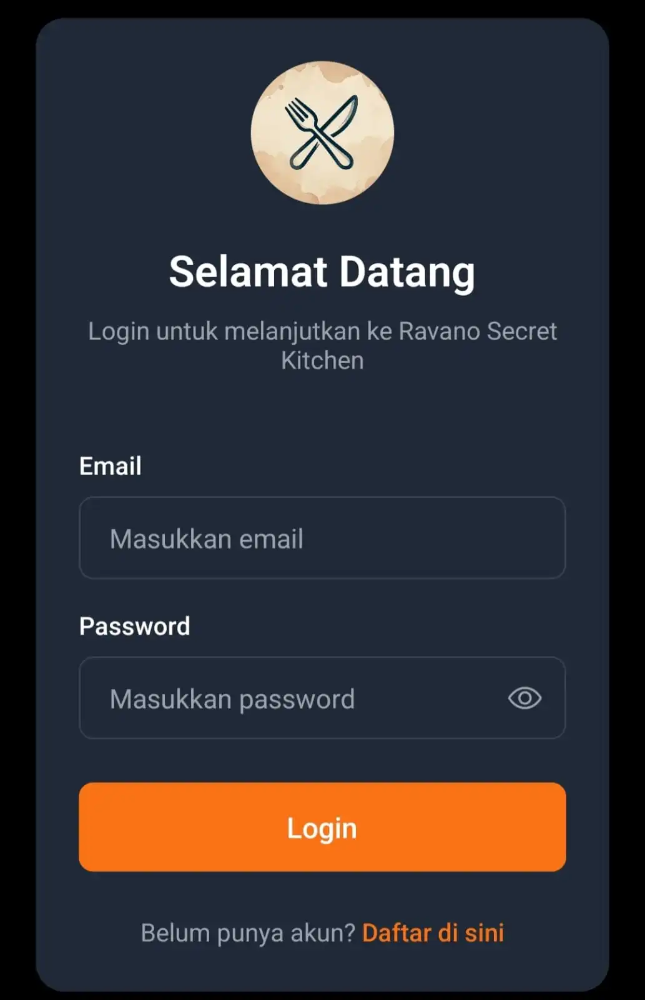
</td>
<td align="center" width="50%">
<b>Register Page</b><br/><br/>
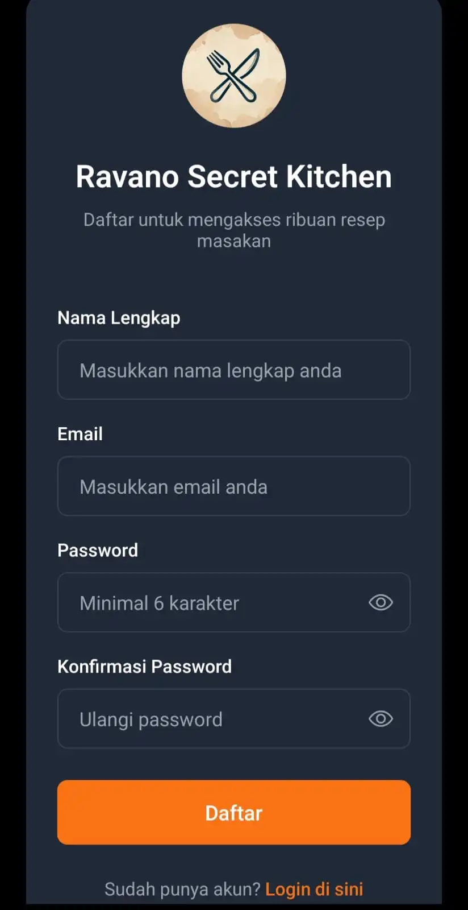
</td>
</tr>
</table>

### 🏠 Home & Search

<table>
<tr>
<td align="center" width="50%">
<b>Home Page</b><br/><br/>
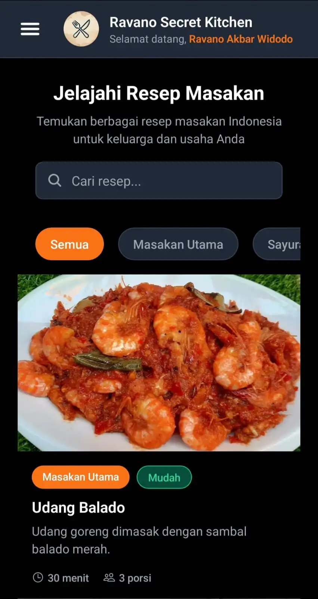
</td>
<td align="center" width="50%">
<b>Search Dialog</b><br/><br/>
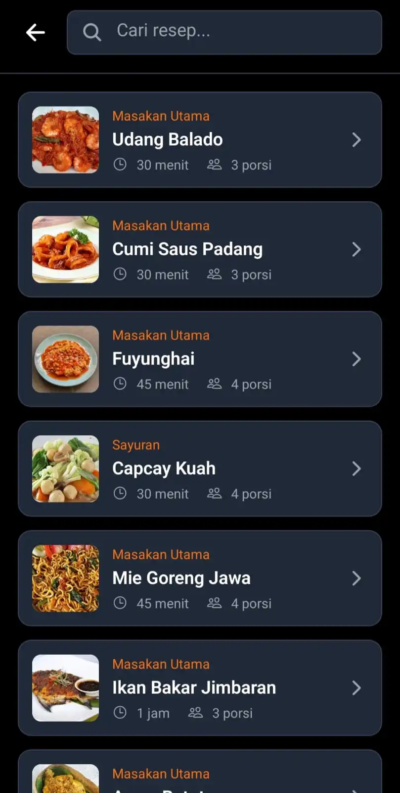
</td>
</tr>
</table>

### 📖 Recipe Detail (3 Tabs)

<table>
<tr>
<td align="center" width="33%">
<b>🥘 Bahan-bahan</b><br/><br/>
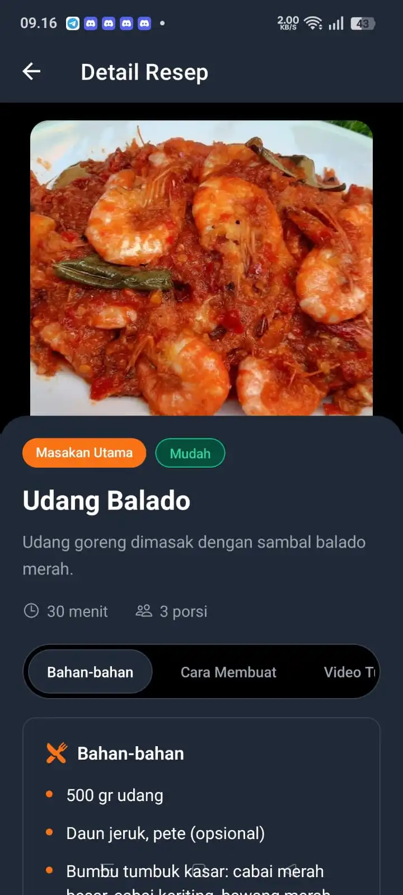
</td>
<td align="center" width="33%">
<b>👨‍🍳 Cara Membuat</b><br/><br/>
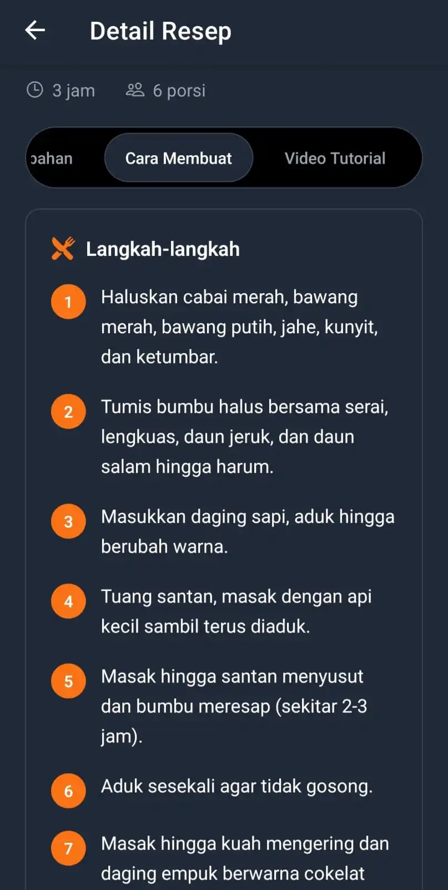
</td>
<td align="center" width="33%">
<b>🎬 Video Tutorial</b><br/><br/>
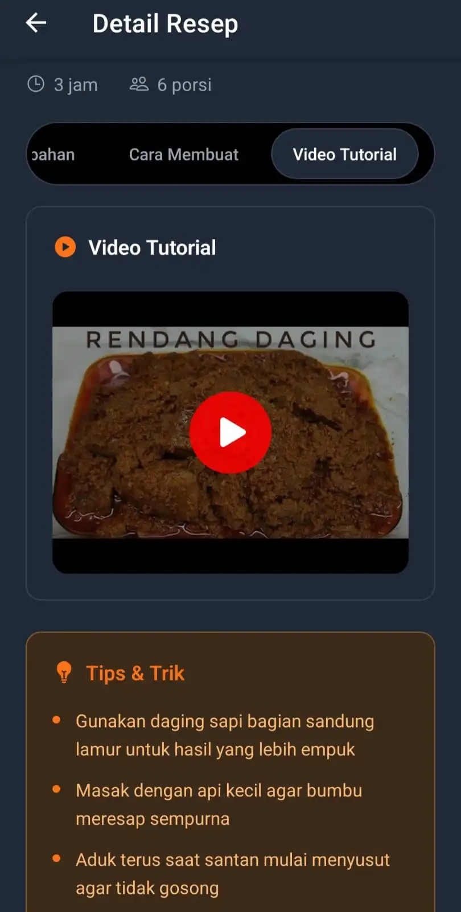
</td>
</tr>
</table>

### 👤 Profile & Modals

<table>
<tr>
<td align="center" width="33%">
<b>Profile Page</b><br/><br/>
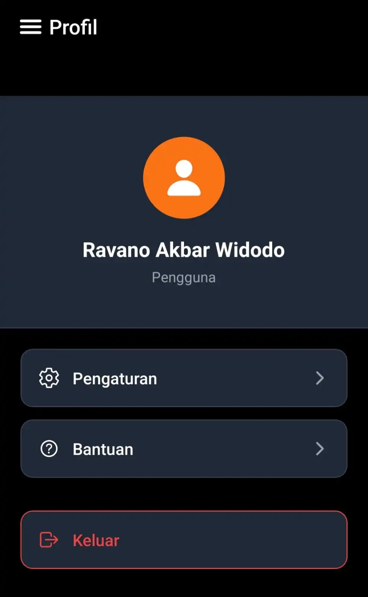
</td>
<td align="center" width="33%">
<b>Logout Modal</b><br/><br/>
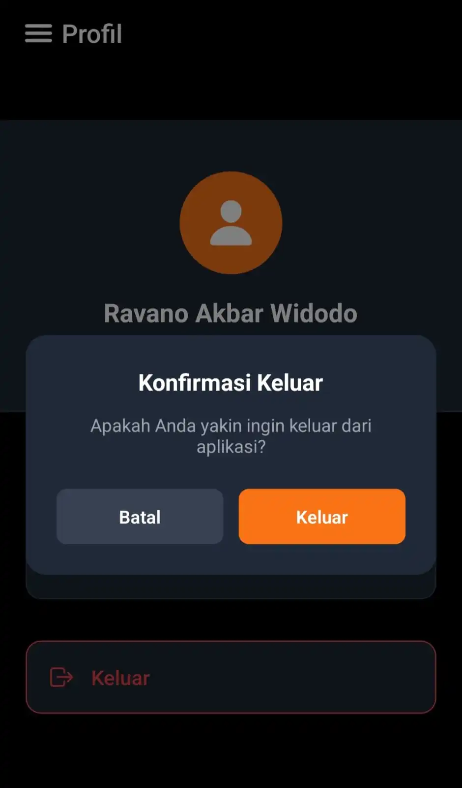
</td>
<td align="center" width="33%">
<b>Settings Modal</b><br/><br/>
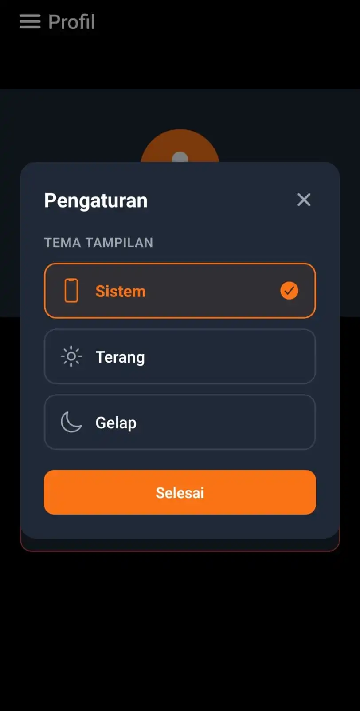
</td>
</tr>
</table>

### 📋 Sidebar

<div align="center">
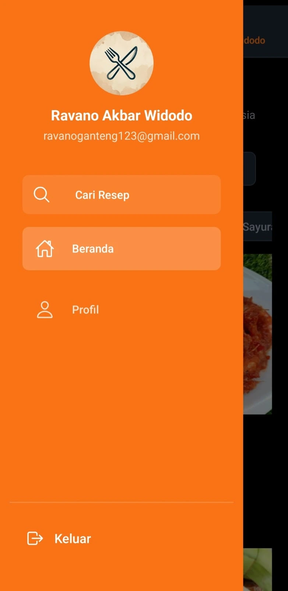
</div>

<br/>

<!-- ==================== SCRIPTS ==================== -->

## 📜 Scripts

| Perintah | Deskripsi |
|:---|:---|
| `npm start` | Menjalankan Expo development server |
| `npm run android` | Menjalankan di emulator/perangkat Android |
| `npm run ios` | Menjalankan di simulator/perangkat iOS |
| `npm run web` | Menjalankan di browser web |
| `npx expo start` | Alternatif menjalankan Expo server |
| `npx expo start --clear` | Menjalankan dengan cache yang bersih |

<br/>

<!-- ==================== AUTHOR ==================== -->

---

<div align="center">

## 👨‍💻 Author


<br/><br/>

**Dibuat dengan ❤️ untuk Final Exam BINUS University**

<br/>


<br/>

⭐ **Jika proyek ini bermanfaat, jangan lupa beri star!** ⭐

</div>
